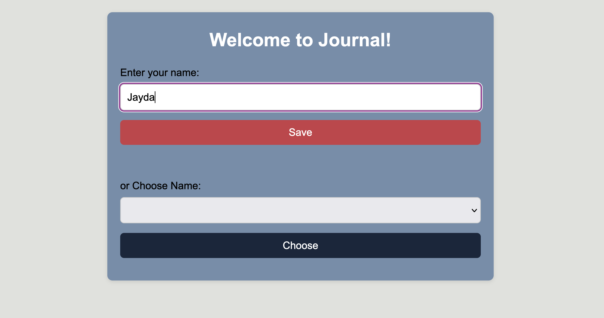
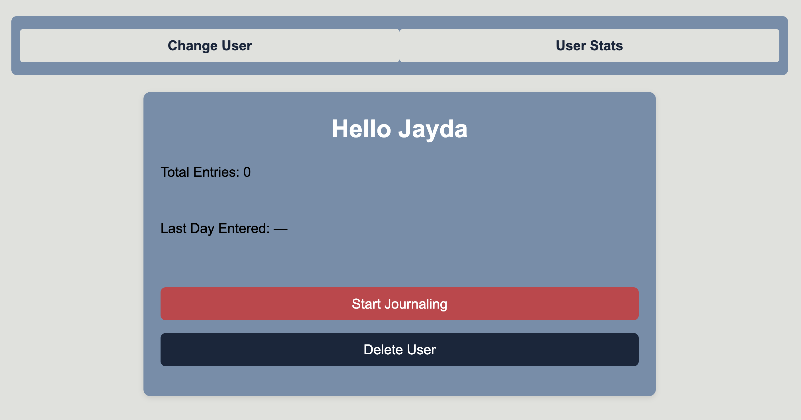
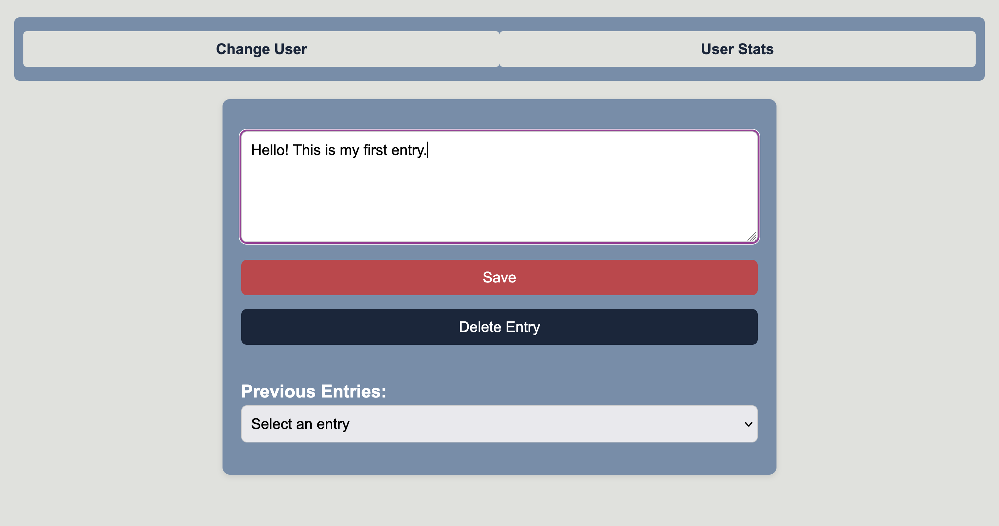
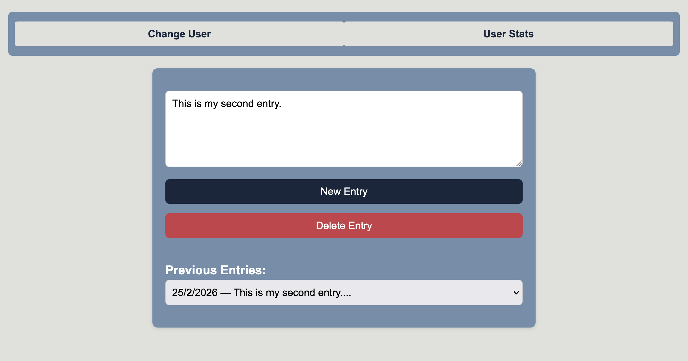

# Personal Journal

A multi-user journaling web app built with vanilla JavaScript. Users can write, save, and delete diary entries, with data persisted in the browser via localStorage.

## Screenshots

## Features
- **Multiple users** — create a new user or switch between existing ones
- **Write entries** — save text entries with an automatic date stamp (DD/MM/YYYY)
- **View past entries** — browse all your entries in a dropdown, select any to read or delete
- **Delete** — remove any entry
- **User stats** — see total entries and the date of your last entry
- **Persistent storage** — all data saved in localStorage, so entries survive page refreshes

## Tech Stack
- HTML
- CSS
- Vanilla JavaScript (ES6 classes, DOM manipulation, localStorage)

## How It Works
Each user is represented by a `User` class holding a name and an array of entries. Entries are stored as objects with text and a formatted date. All users are serialized to localStorage on every change, and rehydrated into `User` instances on page load.

## How to Run
1. Clone or download the repo
2. Open `index.html` in your browser
3. Enter a name to start journaling

No build step or dependencies required.

## What I Learned
- Structuring app logic with ES6 classes
- Managing application state (current user, selected entry)
- Reading/writing structured data to localStorage
- Building multi-page-feel navigation without a framework
